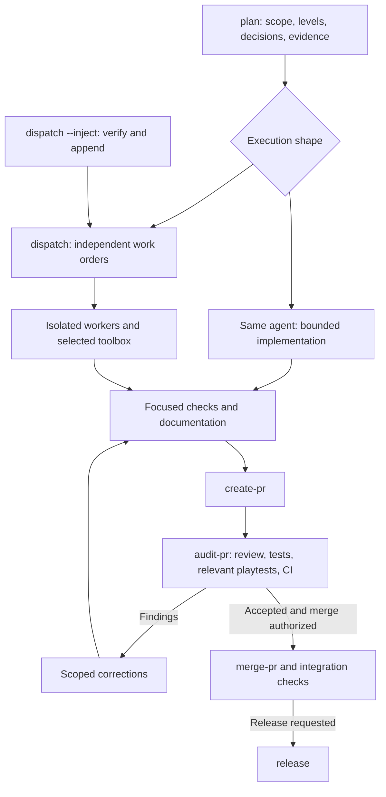

# GameSkills catalog and execution model

Status: initial offering approved for implementation, September 10, 2026.
The catalog describes workflow contracts; the [implementation guide](../gameskills.md)
records supported mechanisms and remaining validation. The [framework
direction](gameskills-framework.md) owns the mission, creative levels, selective
Bevy contribution boundary and development sequence.

## Default entry: plan

`gameskills:plan` is the everyday entry point. It accepts a plain-language goal,
an existing plan, a bug report or an optional issue reference. It identifies the
target game/library, reads relevant code and project guidance, resolves material
choices, applies the creative level and defines the work and evidence needed.

After scope is established, the invoking session remains responsible for carrying
the work to its authorized endpoint. A request to plan produces a plan; a request
to implement and deliver continues through implementation and the applicable PR
workflow. Existing decisions and authorization survive resumed sessions. An
explicitly narrower task takes precedence over a project's default delivery
target. In this repository, implementation delivery normally includes a PR.

For one bounded change, the same agent implements it using the appropriate craft
references and toolbox. For an authorized wave of independent changes, `plan`
produces work orders for `dispatch`. Parallel execution requires an explicit task
request or applicable standing permission; the presence of a skill is not that
permission. Direct use of `debug`, `review`, `playtest` or another toolbox skill
remains supported without forcing a fresh planning cycle.

`setup` is the one-time adoption/configuration entry after installing the core
package. A missing setup is surfaced before dependent execution; a read-only
readiness check does not silently install packages or rewrite project settings.

## Initial catalog

The default installation contains **12 core skills**. Five optional packages offer
nine additional skills, selected explicitly for the project. Each skill has a focused
body with conditional references; installing 21 skills does not mean loading 21
bodies on every task. Names below are logical names. Native invocation syntax and
package metadata must be verified independently in Codex and Claude.

### Core package: gameskills

| Skill | Trigger and responsibility | Result / handoff |
|---|---|---|
| `setup` | Adopt GameSkills, configure a project or deliberately update its installation; inspect existing instructions and supported Bevy/GameKit versions | Selected packages, project commands, compatibility and pinned installation; local ownership preserved |
| `plan` | Start or substantially revise a task; investigate once, define creative scope, decisions, ownership and acceptance | A bounded plan, or work orders and a dispatch queue when parallel execution is authorized |
| `dispatch` | Execute an established wave of independent work; own worker lifecycle, resources, returned results and integration | Completed/blocked stream state, reviewed PRs and verified integration within authorization; `--inject` adds justified work |
| `debug` | Investigate an observed failure or unexplained behavior | Reproduction, causal explanation, proposed correction and regression evidence; unresolved investigation remains explicit |
| `test` | Establish engineering behavior for a change or artifact | Appropriate command graph and actual results for pure, app, runtime or performance checks; selected packages supply specialist cases |
| `playtest` | Assess a player journey or compare game-design hypotheses | Observations, player feedback and prioritized improvements using the task's creative level; human enjoyment is not inferred from passing tests |
| `review` | Evaluate a design or actual change, including code before a PR exists | Actionable findings from relevant Bevy/package guidance plus an open-ended inspection; fixes return to the authorized implementer |
| `update-docs` | Create or reconcile explanations, examples, API guidance and migration documentation | Updated authoritative material and checked references; project history is distilled into durable decisions |
| `create-pr` | Deliver an implemented change for review | Logical commits, pushed source, correct base, concrete PR body and verified PR identity; update an existing PR when appropriate |
| `audit-pr` | Determine whether a specific PR satisfies its planned acceptance and project requirements | An evidence record tied to repository, PR, HEAD, base and relevant inputs; coordinates review, tests, documentation checks and applicable playtests |
| `merge-pr` | Integrate a reviewed change when the session and receiving project authorize it | Revalidated source/CI/review state, observed merge result and appropriate integration checks; incomplete steps stay visible |
| `release` | Prepare or publish a game, library or skill release within the requested scope | Verified distributable artifacts, compatibility, version identities, release information and observed publication when authorized |

`review` owns judgment about the work. `audit-pr` owns the complete acceptance
record for a particular PR. `create-pr` prepares the review artifact; it cannot
declare that artifact accepted. `merge-pr` checks the current state before
integration. `release` concerns actual distributable artifacts and support
commitments. These boundaries allow each task to be requested independently.

Implementation is an agent responsibility supported by Bevy craft references and
the selected specialist skills. There is no additional generic `implement` skill.
Readiness, queue validation, command execution and evidence recording are helpers,
not extra skill bodies. `inject` is a mode of `dispatch`, sharing its queue and
ownership model, rather than a second implementation of coordination.

### Optional packages

| Package | Skill | Responsibility |
|---|---|---|
| `gameskills-ui` | `build-ui` | Design and implement Bevy/GameKit UI within the chosen creative scope; handle view/intent boundaries, layout, focus, input, tooltips and modal lifecycle |
| `gameskills-ui` | `verify-ui` | Inspect rendered layout and native interactions, including focus, hidden state, input methods and accessibility expectations |
| `gameskills-turn-based` | `model-rules` | Model game-owned actions and transitions, legality, stable identity, deterministic replay and adapters for tests/simulation |
| `gameskills-multiplayer` | `design-multiplayer` | Define authority, visibility, protocol/session boundaries, admission and reconnect behavior from the game's requirements |
| `gameskills-multiplayer` | `verify-multiplayer` | Verify required process/transport scenarios, failures, disclosure and lifecycle; record the actual machines and network used |
| `gameskills-maintainer` | `evolve-gamekit` | Design or refine a reusable GameKit capability, its contract and consumer migration using demonstrated game needs |
| `gameskills-maintainer` | `author-skill` | Create or revise a canonical skill, its triggers, focused references and deterministic helpers from observed needs |
| `gameskills-maintainer` | `evaluate-skills` | Compare behavior, quality, installation and cost across candidates and supported agents; recommend or reject promotion |
| `gameskills-bevy-contrib` | `prepare-contribution` | Investigate a verified engine bug or compelling engine-level gap and prepare technical evidence for human review under Bevy's contribution policy |

Each package can also contribute references and check recipes used by core
planning, testing and review. A networking change selects the multiplayer
guidance in those workflows; it does not create another planning or PR pipeline.
Package-specific verification can be a step in the core test/audit graph, avoiding
duplicate command execution. Core playtesting owns the overall player journey;
UI verification owns the particular rendering and interaction evidence.

Initial adoption can use core plus UI, followed by the rules and multiplayer
packages as their tasks arise. Maintainer skills serve this repository's own
refactor. The contribution package is optional and can follow later; no ordinary
game or GameKit change needs an upstream proposal.

Simulation/balance, content pipelines, procedural worlds and platform-specific
publishing remain later candidates. They are outside this proposed first-release
catalog; concrete skills and support promises need real tasks first. Version
migrations, ordinary profiling and project architecture are covered by the core
and its references rather than separate skills for every Bevy subsystem.

## The complete pipeline

The plan records the requested endpoint: design, implementation, reviewable PR,
merge or release. The graph continues only through the authorized stages. A
successful audit may be the final handoff when another contributor owns review
or merge. This is especially relevant to the later Port Vila pilot.

The same coordinator session selects and invokes the applicable skill through
the host's supported mechanism. Where a client has no dedicated invocation tool,
the adapter resolves and loads the installed instructions explicitly. A Markdown
link does not execute another skill, and each skill invocation need not create
another agent. Skill selection and result handling must be tested in both hosts.

During implementation, use focused checks for feedback and update documentation
before the final audit when possible. At the final source revision, `audit-pr`
assembles the required evidence from `review`, `test`, applicable `playtest` /
specialist verification and project CI. A purely internal or documentation change
does not automatically require native game interaction. A visual or gameplay
claim needs the corresponding evidence.

Run a required check once for its applicable inputs, then reuse its recorded
result only while those inputs remain valid. Do not run the full test suite once
per review lens or skill invocation. Source, base, configuration, dependency,
artifact or environment changes invalidate affected evidence; when the dependency
of a check on those inputs is uncertain, rerun it. Never rewrite an old record to
claim it belongs to a newer HEAD. Early implementations can conservatively rerun
checks until narrower reuse has been demonstrated safe.

## What plan hands to dispatch

One versioned work-order contract is shared by `plan`, `dispatch` and `--inject`.
It records:

- Goal, expected artifact, creative scope, accepted decisions and delivery target.
- Repository, source revision, target game/crate, Bevy/GameKit versions and selected
  packages. An issue link is optional; a local work-order identity is sufficient.
- Relevant investigation results: symbols and source locations, observed facts,
  reproduction or design evidence, and the limited references the worker needs.
- Owner, file/region boundaries, shared resources and the intended combined result
  where multiple changes meet. Include other contributors' work in that map.
- Separate `dispatch_blockers` and `merge_blockers`, with verifiable prerequisites.
- Model role/effort, concurrency/resource constraints and any agreed work budget.
- Acceptance checks, retained or deliberately changed contracts, expected evidence,
  and conditions requiring coordination rather than independent scope expansion.

Persist decisions and orders where workers can read them. A small solo task needs
only a compact plan; a multi-worker wave needs a durable shared queue. Keep one
authoritative queue with views derived from it. Preserve decisions and meaningful
outcomes when retiring temporary orders; historical maps must not masquerade as
current source documentation.

### Dispatch and integration

Launch only work with settled scope and satisfied start dependencies, using the
actual supported worker mechanism and an explicitly verified worktree. A worker
that shares the coordinator's checkout is not isolated merely because it has an
agent ID. Verify the checkout and base again on resume. Prevent concurrent
ownership of the same region; shared manifests, lockfiles, registries, fixtures
and assets need an explicit integration owner or sequencing rule.

The dispatcher tracks available slots, starts useful independent work promptly
and names concrete reasons for waiting. The configured cap is a limit, not a
requirement to create extra work. CPU/memory, GPU/window access, audio, ports and
multi-process game tests constrain concurrency alongside file ownership. Human-
owned streams occupy territory and integration order without consuming an agent
slot. Other contributors' work is not automatically reassigned to workers.

Workers return actual changes, source identity, PR/evidence references, findings
and remaining blockers. They remain responsible for their running checks until
results are collected; stopping a process or exhausting a budget is not completion.
The coordinator reviews the returned work, checks how it combines with siblings,
and integrates accepted changes serially within authorization. Tests that passed
on separate branches do not prove that the combined application works.

If one worker discovers a shared source, environment or verification defect,
inform affected workers promptly and reassess their evidence. Refresh affected
maps and checks when the base changes. Resume useful partial work when possible
instead of launching another agent to rediscover it.

### Adding work with dispatch --inject

1. Ground the request in current evidence. Reproduce a reported defect or verify
   the need and scope of a requested addition; an unverified symptom is not a fix.
2. Check relevance to the current wave and the live ownership of planned, running
   and human-owned work. Recheck source facts that may have changed.
3. Prepare the new order with the same contract, separate start/merge blockers
   and a recorded reason for the addition. Respect the current authorization.
4. Append it to the authoritative queue and update derived views in one recorded
   change. Start it when independent work and resources permit, or name the blocker.

Injection adds work. A change to an existing stream's ownership or accepted design
returns to `plan` for an explicit amendment, with affected workers coordinated.
Within-scope fixes remain with their current owner; unrelated discoveries are
recorded separately rather than silently expanding the wave.

## Creative levels, agent roles and cost

The four [creative levels](gameskills-framework.md#proposed-levels-of-creative-involvement)
travel with the plan: implement, refine, co-design and explore. A worker order can
specify the exact implementation of a decision reached during co-design. The
creative level is independent of model capability, testing rigor and permission
to publish. Levels 3 and 4 do not automatically authorize unlimited agents or
open-ended scope.

Use project-configured roles for exploration, routine implementation, difficult
design and review. Resolve the actual model and effort supported by the host;
pass configured choices explicitly at launch. A label in an order does not select
the model. Preserve the session's defaults unless a model override is authorized.
Use economical workers for well-mapped work and more capable roles where judgment
or discovery warrants them. Review capability must be appropriate to the work;
the proposed default follows JXP's rule that review is not assigned a weaker role
than implementation. Model self-description alone is not verified telemetry.

Measure total coordinator and worker usage, cache reads/writes where exposed,
elapsed time, retries, review rounds, correctness and corrective user interventions.
Missing telemetry is unavailable, not zero. Compare against a solo baseline on
representative tasks. Parallelism can reduce elapsed time while increasing cost;
retain it where the measured tradeoff is useful.

The primary economy measures are focused orders, reusable verified investigation,
small conditional skill bodies, bounded review scope, appropriate model roles,
resource-aware scheduling and avoiding repeated checks on unchanged inputs. Extra
reviewers or whole-repository audits require a reason tied to the task.

## Tools and project ownership

Use small deterministic helpers for installation identity/configuration, queue
validation and state, command execution, resource coordination, evidence records
and available usage summaries. Keep judgment in skills, and maintain one contract
for each shared artifact. There is no need to reproduce every part of JXP's runtime
before the first useful candidate.

Project configuration owns package selection, game/crate targets, commands,
platforms, model-role mappings, execution defaults and review/release requirements.
The installation lock owns package source identities. GitHub or issue-tracker
adapters are replaceable; Linear, cloud deployment and JXP's enterprise policies
are not core dependencies. Core plus selected package instructions should coexist
with the consumer's local skills and repository rules.

## Proof before claiming the framework works

The first trials should cover a solo documentation change, a GameKit UI change
used by both games, a bounded parallel wave, and a verified mid-wave addition.
Exercise collisions, actual start vs merge dependencies, unavailable resources,
interruption/resume, stale evidence and rejected findings. Evaluate creative
levels and direct toolbox invocation as well as the main entry point.

Run representative tasks through both supported clients and their real installed
packages. Compare the current pack, candidate and a no-skill/solo baseline where
appropriate. Verify outcomes and total cost, not just schema validity, skill
counts or model labels. The retained installation and behavioral acceptance
requirements in the framework document still apply.

## JXP investigation and provenance

Inspected the Hartford checkout at `b11265ad9681f54a0e365416ce655d279b53f437`, then
fetched and read the newer [PR #166](https://github.com/jxp-software/jxp-skills/pull/166)
head `3c35cddd8a484891a93e26f3ac06635fde4c1812` without switching its checkout.
Also read the pre-native plan/dispatch contracts at
`713bc5d1027dfca84d0d2e5d3fb9dc03b597d73f` and the original injection skill.

- [Native plan](https://github.com/jxp-software/jxp-skills/blob/3c35cddd8a484891a93e26f3ac06635fde4c1812/plugins/jxp/skills/plan/SKILL.md): reuse approved context, save investigation in self-contained orders, distinguish start and merge prerequisites.
- [Native dispatch](https://github.com/jxp-software/jxp-skills/blob/3c35cddd8a484891a93e26f3ac06635fde4c1812/plugins/jxp/skills/dispatch/SKILL.md) and [worker contract](https://github.com/jxp-software/jxp-skills/blob/3c35cddd8a484891a93e26f3ac06635fde4c1812/plugins/jxp/references/worker-contract.md): explicit model launches, real isolation, human territory, completed checks, source-specific evidence and serial integration.
- [Original inject](https://github.com/jxp-software/jxp-skills/blob/ecfb6684977fe16c8331b358c9e151a67454d3d9/template/.claude/skills/inject/SKILL.md) and its [consolidation commit](https://github.com/jxp-software/jxp-skills/commit/412424b21fd1a70aa8f219dd13b13e99d78881ab): ground the claim, check live ownership and append work; the current native skill exposes this as `dispatch --inject`.
- [Token profiling](https://github.com/jxp-software/jxp-skills/blob/3c35cddd8a484891a93e26f3ac06635fde4c1812/docs/planning/design/skill-token-profiling.md): measured examples support scoped context and role selection; its attribution caveats and small samples preclude a general savings guarantee.
- [Rule-parity ledger](https://github.com/jxp-software/jxp-skills/blob/3c35cddd8a484891a93e26f3ac06635fde4c1812/docs/development/skill-rule-parity.md): short skill bodies need explicit destinations or retirement reasons for useful legacy rules; line-count reduction alone does not establish correctness.

JXP's native refactor and adopter acceptance remain in progress. Its documented
results inform this design; they do not establish GameSkills installation parity,
runtime behavior, or cost savings.
